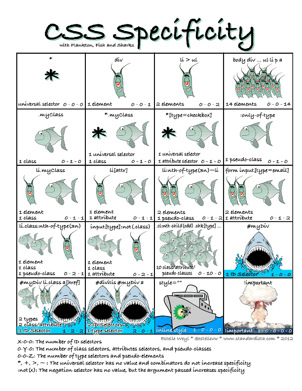

# :star: Welcome To Session 2 :star:

...Quick recap...
## 0- HTML?
- tags -> selectors
- attributes?
  - img alt
- semantics -> accessibility

***okay, let's pick up the pace a little***
---
## 1- Start CSS
- ***ideas for demo topic:***
  - Trying out for band starter HTML
- Link to CSS in HTML
- Selecting a ___
- Selector Specificity

    
 Click for Image 

    

- CSS Properties
- Sizes 
- Box Model
- Display: Inline, Block, and Inline-Block